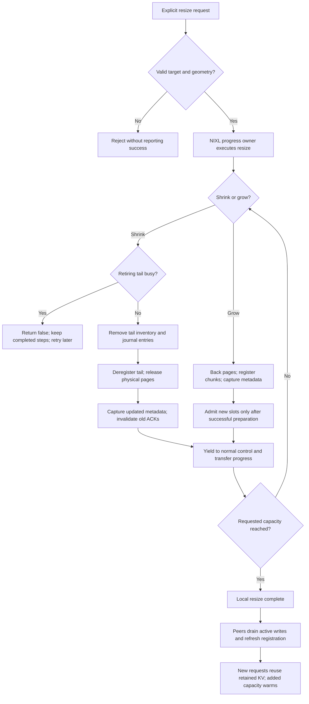

# Online G2 resizing prototype

This branch explores explicit physical resizing of KVCR-managed G2 while keeping the instance running and retained cache addresses stable. It does not resize the framework's native CPU tier. It is a research prototype, not merge-ready or production-safe under arbitrary concurrent traffic.

```python
GiB = 1 << 30
# Add g2_resize_granularity_bytes=64 << 20 to KVCRConfig at construction.
done = kvcr.resize_g2("", 30 * GiB)
# False: a retiring block is filling, claimed, or in flight; retry later.
```

Worker-owned G2 provides `KVCRBindings.resize_g2_memory(name, old_bytes, new_bytes)`, which must back/release memory without moving the reservation. Service-owned G2 updates its backing and effective capacity over the primary's existing lease. Shrink removes retiring cache inventory, deregisters tail chunks, then releases physical tmpfs pages. Growth backs/registers chunks before admitting slots. The fixed maximum mapping remains; allocated pages change. Registration chunking is opt-in; existing default registration behavior is retained.

## Short usage guide

1. At construction, enable `g2_resize_granularity_bytes=64 << 20`. This single **64 MiB (67,108,864-byte)** quantum governs requested-capacity alignment, physical work and registration. Reject nonaligned targets rather than rounding; remain within the startup reservation and require whole KV blocks per chunk. Worker backing also requires page-aligned geometry. Existing GiB targets remain valid; historical small tests retain smaller units. The global default stays disabled (`0`).
2. Supply the worker-owned physical-memory binding above, or use the service-owned held lease. Call from the operator/framework thread, not a state-locked callback or the NIXL progress thread. There is no vLLM CLI/operator endpoint yet; the examples assume constructed KVCR objects and an integrated backing allocator.
3. For a 100 GiB combined budget, reserve at least 70 GiB per instance, then initially shrink each to 50 GiB. This prototype physically allocates ceilings at bootstrap: allow 140 GiB plus framework buffers, journals, registration and process headroom before reducing to the steady 100 GiB budget.
4. Shrink the donor, confirm physical release, then grow the recipient. `False` means a busy tail: retry later and do not grow the recipient yet. Exceptions are failures, not successful resize. Completed steps remain committed when a later step is busy/fails; summary logs report effective capacity. Retry the original target to finish an interrupted shrink. `True` is local completion, not proof that every peer has refreshed or that new capacity is warm.

The vLLM integration candidate uses its existing deferred utility response:

```python
done = await engine.engine_core.call_utility_async("resize_kvcr_g2", 30 * GiB)
```

The operator awaits completion, but the scheduler does not wait on that thread. This utility requires exactly one KVCR tier on an OffloadingConnector; it is not an HTTP endpoint. The [vLLM companion branch](https://github.com/karya0/vllm/tree/poc/online-g2-resize-engine) is maintained separately from this KVCR repository and still needs full model-serving validation.

```python
# A and B are live KVCR instances already serving at 50 GiB each.
GiB = 1 << 30
if a.resize_g2("", 30 * GiB):
    # Operator verifies backing-page decrease before allocating to B.
    grown = b.resize_g2("", 70 * GiB)  # Check completion; exceptions are failures.

# Later, after demand switches to A:
if b.resize_g2("", 30 * GiB):
    # Verify the physical release again, then grow A.
    grown = a.resize_g2("", 70 * GiB)
```

Do not measure release by file length: the virtual reservation remains fixed. For the prototype's tmpfs files, use allocated blocks (`stat().st_blocks * 512`); also track cgroup/shmem memory and headroom. A failed grow can leave total G2 below budget; do not treat the two calls as an atomic cross-instance transaction.



Peer refresh can overlap later traffic; it is not an additional synchronous step guaranteed complete at API return. The flow shows successful operations; failure/rollback limitations are described below.

## Runtime tradeoffs

The intended benefit is to redistribute spare host RAM to a pressured cache, retaining its existing KV and potentially reducing evictions/recomputation. This model-serving benefit is not yet measured.

Each quantum runs on the NIXL progress thread under the state lock; normal polling runs between steps. Shrink discovers only owners of retiring slots, retaining READY/claim/in-flight checks. Growth and unchanged-size requests visit no cache records. Resize-enabled instances keep an owner pointer per reserved slot (about8MiB per million slots); static instances allocate no index. Recovery restores ownership, and replacement regrowth extends the index before admitting new slots. Free-slot deque filtering, evictions, service RPCs, page allocation/release, registration and metadata capture can still delay a single step; byte count is not a wall-time guarantee. Stage logs report `scan`, `evict_publish` (including journal callbacks), `backing`, `register`, `deregister`, `metadata`, `admit` and exceptional `rollback` costs; the existing duration histogram also records `resize_<stage>` when telemetry is enabled. Summary logs report requested/effective bytes, completed steps, outcome and total elapsed time. The default source-stall watchdog remains unchanged: a single step longer than its timeout can still disable source writes, so measure maximum step costs before scaling.

Smaller chunks increase startup registration count and metadata size; the current chunk setting also applies to registered framework DRAM, not only G2. Cache removed during shrink may have to be recomputed. Large removal bursts may pressure the recovery journal. Concurrent resize commands on one instance are rejected; cross-instance redistribution is not atomic.

A small Linux same-host CPU NIXL/UCX PoC released/reallocated 16 MiB between live instances. One initial pass measured roughly 5.3 ms shrink and 10.9 ms growth. Retained addresses/bytes, remote reads into grown chunks, and service-owned Guard delivery after a completed-resize primary crash passed. These are small operation timings, not TTFT/throughput results or predictions for large pools/RDMA. Independent repeat timings varied, particularly growth.

## Review blockers and limits

Snapshot-bound ACKs, capture-before-growth-admission, callback deadlock rejection, fractional watermarks and unresolved-rollback containment now have regression coverage. Shrink capture failure withholds stale metadata until retry. See the [review disposition](online-g2-resize-review.md).

Peer refresh now defers registration-bearing messages and pauses new native writes only to that peer until its existing native handles complete and release. Queued retained writes keep their generation only for the same known process incarnation and unchanged native handle; replacement/unknown peers and failed reloads remain fenced. Deferred requests retain their original deadlines. Continuous C8/100-cycle native tests pass in both ownership modes, including physical backing changes and service-owned Guard/replacement checks.

When NIXL provides `invalidate_remote_memory`, same-incarnation refresh drops remote registrations without disconnecting the peer, after all native writes complete and release. The experimental NIXL API also requires releasing prepared remote descriptor handles before invalidation; KVCR does not retain them. Matched CPU UCX tests hold socket counts constant across 100 refreshes, including notifications and rotating registrations. This requires a separately patched NIXL runtime; older runtimes fall back to full disconnect and retain the demonstrated socket-growth limitation. Replacement/unknown incarnations still disconnect. Non-UCX backends, crashes inside resize transitions, model-serving performance and cross-node RDMA remain unverified. A higher descriptor limit is not a production fix.

Supported scope: one pool; positive chunk-aligned sizes within the initial reservation; no automatic resizing policy; retry-based busy shrink. The ceiling is physically allocated once at bootstrap. An already-promoted Guard has no resize API. Framework integration still needs an invocation path, callback/event thread-safety validation, and a backing-memory binding for worker-owned G2. Existing routing need not change solely for resizing if eviction events are delivered correctly.

Unit tests cover allocator/registration ordering and selected failures. This branch also includes the [small native Linux PoC](online-g2-resize-poc.md); it is not a production engine integration.
